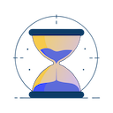

***
<h1 align="center">

Motivational Age Counter
</h1>

***

Motivational Age Counter is a NewTab extension. It keeps you motivated to work on your goals with a motivation quote and a counter for your age using your favorite color combinations.

### Features:
- [x] Display age counter with customizable number of decimal digits
- [x] Add your own motivation text
- [x] Light / Dark Themes
- [x] Random Color Combinations to suit your mood
- [x] Customize NewTab name

### Getting Started:
1. Clone the repository
2. Run `npm install`
3. Run `npm run build`
4. Load the extension in Chrome
    - Open Chrome and go to `chrome://extensions/`
    - Enable Developer Mode
    - Click on Load Unpacked
    - Select the `dist` folder in the repository

### License:
See the [LICENSE](./License.txt) file for license rights and limitations (MIT).

### Contributing:
Please open an issue first to discuss what you would like to change. Pull requests are welcome.

<!-- Icon: [text](https://react-icons.github.io/react-icons/search/#q=sand)

Privacy policy: no need, no data is collected

Inspire from Daily Motivation [text](https://chromewebstore.google.com/detail/daily-motivation-age-coun/ndjleggnmncjmfjcgmmpimpccikiadaf)

-->
